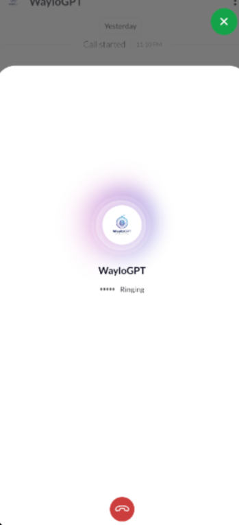
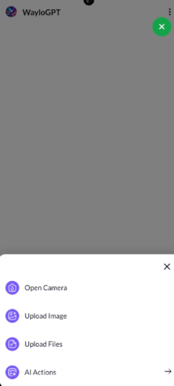

## Waylo

**Waylo** is an AI-powered travel planner mobile application built using:

* React Native (CLI)
* TypeScript
* Gluestack UI
* Tailwind CSS (NativeWind)
* Supabase Authentication

It features an intelligent AI assistant called **WayloGPT**, helping users generate smart itineraries, discover destinations, and plan trips effortlessly.

---

## ✨ Features

* 🤖 AI Travel Assistant – WayloGPT
* 🔐 Secure Authentication
* 🎨 Modern UI with Gluestack UI
* 💅 Styled using Tailwind CSS
* ⚡ Smooth and optimized performance
* 📱 Android Support

---

## 🛠 Tech Stack

| Technology       | Purpose          |
| ---------------- | ---------------- |
| React Native CLI | Mobile Framework |
| TypeScript       | Type Safety      |
| Gluestack UI     | UI Components    |
| Tailwind CSS     | Styling          |
| Supabase         | Backend & Auth   |
| WayloGPT         | AI Travel Engine |

---

# 📸 App Screenshots

| | | |
|---|---|---|
| <a href="./screenshots/0.png"></a> | <a href="./screenshots/1.png"></a> | <a href="./screenshots/2.png"></a> |
| <a href="./screenshots/3.png"></a> | <a href="./screenshots/4.png"></a> | <a href="./screenshots/5.png"></a> |
| <a href="./screenshots/6.png"></a> | <a href="./screenshots/7.png"></a> | <a href="./screenshots/8.png"></a> |
| <a href="./screenshots/9.png"></a> | <a href="./screenshots/10.png"></a> | <a href="./screenshots/11.png"></a> |
| <a href="./screenshots/12.png"></a> | <a href="./screenshots/13.png"></a> | <a href="./screenshots/14.png"></a> |
| <a href="./screenshots/15.png"></a> | <a href="./screenshots/16.png"></a> | <a href="./screenshots/17.png"></a> |
| <a href="./screenshots/18.png"></a> | <a href="./screenshots/19.png"></a> | <a href="./screenshots/20.png"></a> |


## 🚀 Getting Started

### Install Dependencies

```bash
npm install
````

or

```bash
yarn install
```

---

### Start Metro

```bash
npm start
```

---

### Run the App

#### Android

```bash
npm run android
```

---

## 📦 Generate Release Build (Android)

### APK

```bash
cd android
gradlew assembleRelease
```

Output:

```
android/app/build/outputs/apk/release/app-release.apk
```

### App Bundle (Play Store Recommended)

```bash
gradlew bundleRelease
```

---

## 🔐 Environment Variables

Create a `.env` file:

```
SUPABASE_URL=your_url
SUPABASE_ANON_KEY=your_key
```

---

## 👨‍💻 Author

**Santosh Saha**
AI Travel Planner – Waylo

---

## 📄 License

This project is available for educational and production use.

---

[Download this app](https://upload.app/download/waylo/com.waylo/345acd945334ac3592bf2dca17773370e443a9686369f809bf7e1e54a3633b81)


