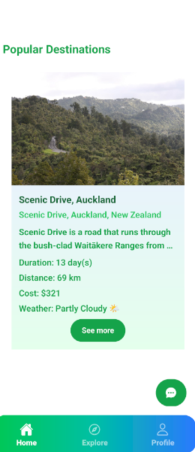
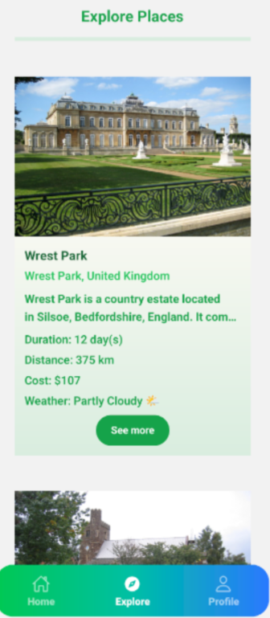
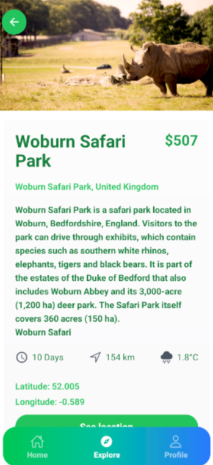
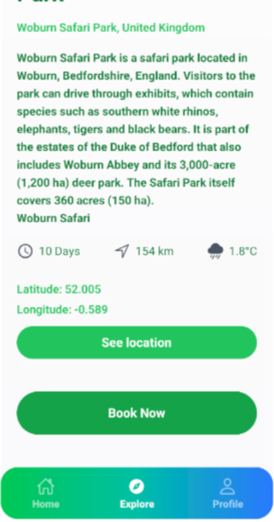
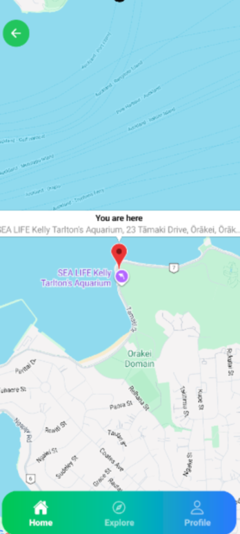
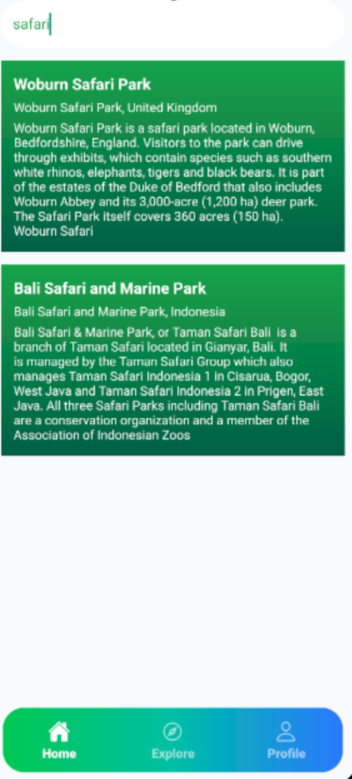

## Waylo

**Waylo** is an AI-powered travel planner mobile application built using:

* React Native (CLI)
* TypeScript
* Gluestack UI
* Tailwind CSS (NativeWind)
* Supabase Authentication

It features an intelligent AI assistant called **WayloGPT**, helping users generate smart itineraries, discover destinations, and plan trips effortlessly.

---

## ✨ Features

* 🤖 AI Travel Assistant – WayloGPT
* 🔐 Secure Authentication
* 🎨 Modern UI with Gluestack UI
* 💅 Styled using Tailwind CSS
* ⚡ Smooth and optimized performance
* 📱 Android & iOS Support

---

## 🛠 Tech Stack

| Technology       | Purpose          |
| ---------------- | ---------------- |
| React Native CLI | Mobile Framework |
| TypeScript       | Type Safety      |
| Gluestack UI     | UI Components    |
| Tailwind CSS     | Styling          |
| Supabase         | Backend & Auth   |
| WayloGPT         | AI Travel Engine |

---

# 📸 App Screenshots

| 1                                            | 2                                            | 3                                            |
| -------------------------------------------- | -------------------------------------------- | -------------------------------------------- |
|  |  |  |

| 4                                            | 5                                            | 6                                            |
| -------------------------------------------- | -------------------------------------------- | -------------------------------------------- |
|  |  |  |

| 7                                            | 8                                            | 9                                            |
| -------------------------------------------- | -------------------------------------------- | -------------------------------------------- |
|  |  |  |

| 10                                            | 11                                            | 12                                            |
| --------------------------------------------- | --------------------------------------------- | --------------------------------------------- |
|  |  |  |

| 13                                            | 14                                            | 15                                            |
| --------------------------------------------- | --------------------------------------------- | --------------------------------------------- |
|  |  |  |

| 16                                            | 17                                            |
| --------------------------------------------- | --------------------------------------------- |
|  |  |

---

## 🚀 Getting Started

### 1️⃣ Install Dependencies

```bash
npm install
```

or

```bash
yarn install
```

---

### 2️⃣ Start Metro

```bash
npm start
```

---

### 3️⃣ Run the App

#### Android

```bash
npm run android
```

---

## 📦 Generate Release Build (Android)

### APK

```bash
cd android
gradlew assembleRelease
```

Output:

```
android/app/build/outputs/apk/release/app-release.apk
```

### App Bundle (Play Store Recommended)

```bash
gradlew bundleRelease
```

---

## 🔐 Environment Variables

Create a `.env` file:

```
SUPABASE_URL=your_url
SUPABASE_ANON_KEY=your_key
```

---

## 👨‍💻 Author

**Santosh Saha**
AI Travel Planner – Waylo

---

## 📄 License

This project is available for educational and production use.
---

---
[Download this app](https://upload.app/download/waylo/com.waylo/27be6a0b4bf566d8daa02086ad4e0131873e1d8e57bf3014ea8e9bc95df97dfa)
---

